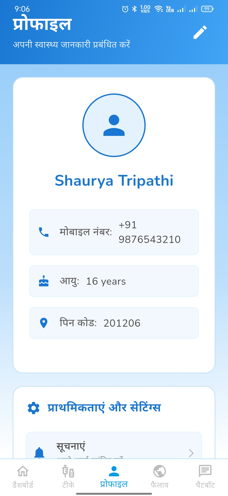
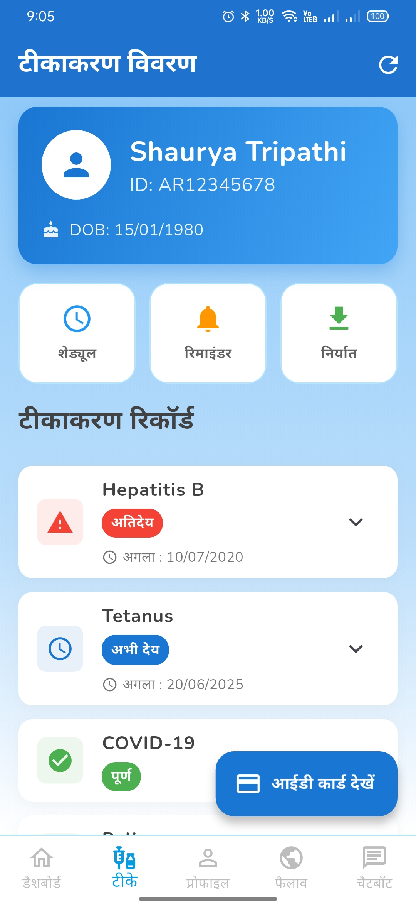
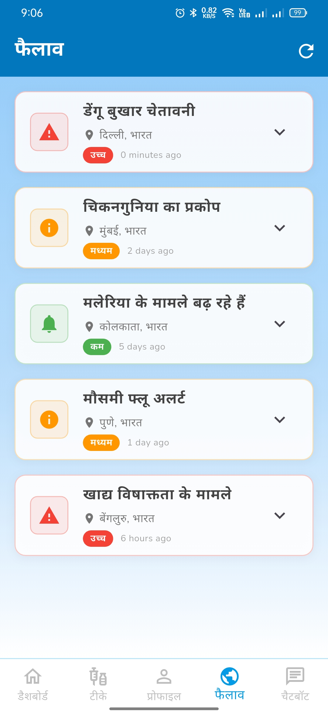
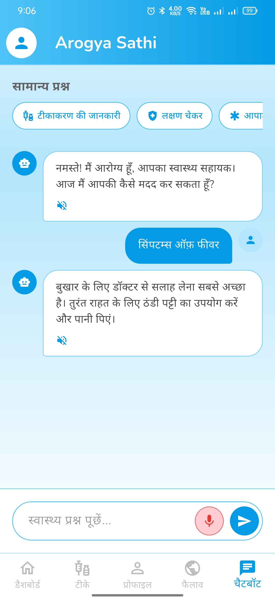
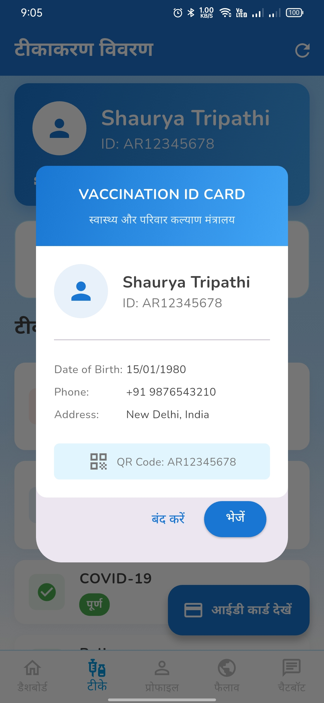

# 🏥 Arogya Sathi  

  
  
  
  

*Arogya Sathi* is a healthcare companion app designed for rural communities in India.  
It provides vaccination schedules, outbreak alerts, digital vaccination ID cards, and a healthcare chatbot in a simple, minimal UI.  

---

## 📱 Features  

✅ **Vaccination Management** – Track schedule & generate digital vaccination ID card  
✅ **Profile Section** – Save details like Name, Phone, Age, and Pincode  
✅ **Outbreak Alerts** – Real-time outbreak notifications with precautions  
✅ **Health Chatbot** – Ask questions about vaccination & healthcare  
✅ **Minimal UI** – Simple, large-text design for rural audiences  
✅ **Multilingual** – Support hindi or english language
✅ **Text-To-Speech** – Hindi or English language voice support
✅ **Speech-To-Text** – Hindi or English language voice support

---

## 📸 Screenshots  

  
  
  
  
  
  
  

  

---

## 🛠️ Tech Stack  

- **Frontend:** [Flutter](https://flutter.dev/)  
- **Backend:** [Firebase](https://firebase.google.com/) (Authentication, Firestore, Cloud Messaging)  
- **Notifications:** Firebase Cloud Messaging (FCM)  
- **Chatbot:** Dialogflow / RASA / Custom API (future integration)  

---

